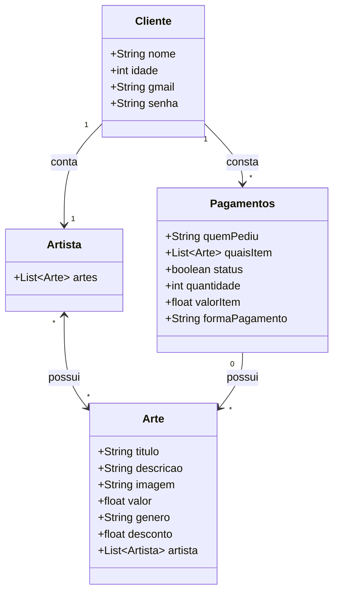

# FotoHub

Feito com Fastify 

## Descricao

Esse projeto tem como objetivo vender **quadros de artes**, possui formas de cadastro de **cliente** e **Artista**. Foi um projeto utilizou JWT para criacao de **Token de autenticacao**, feito 100% em **Fastify**. Nesse projeto tambem utilizei o **WS** do fastify, criando uma instancia para o **WebSocket** e o servico do *ws* foi utilizado como chat de **grupo** ou **privado**, entao o projeto responde a metodos *HTTP* e a *WS* (no endpoint **/chat**).

E como banco de dados utilizei duas abordagens: **MongoDB local** e mongoDB online, com **MongoDB Atlas**.

### Requisitos nao funcionais

- TypeScript
- Fastify
- JWT
- mongoose (MongoDB)
- WebSocket
- zod
- Google Generative ai

## Comandos

Executar projeto: `npm run dev`

## Dependencias

```json
"devDependencies": {
    "@types/jsonwebtoken": "^9.0.7",
    "@types/mongoose": "^5.11.97",
    "@types/node": "^22.5.0",
    "@types/ws": "^8.18.0",
    "tsx": "^4.19.0",
    "typescript": "^5.5.4"
}
```

```json
"dependencies": {
    "@fastify/cors": "^10.0.1",
    "@fastify/jwt": "^9.0.1",
    "@fastify/websocket": "^11.0.2",
    "@google/generative-ai": "^0.24.0",
    "dotenv": "^16.4.5",
    "fastify": "^5.0.0",
    "fastify-jwt": "^4.2.0",
    "fastify-type-provider-zod": "^3.0.0",
    "jsonwebtoken": "^9.0.2",
    "mongoose": "^8.6.3",
    "ws": "^8.18.1",
    "zod": "^3.23.8"
}
```

## Diagrama


