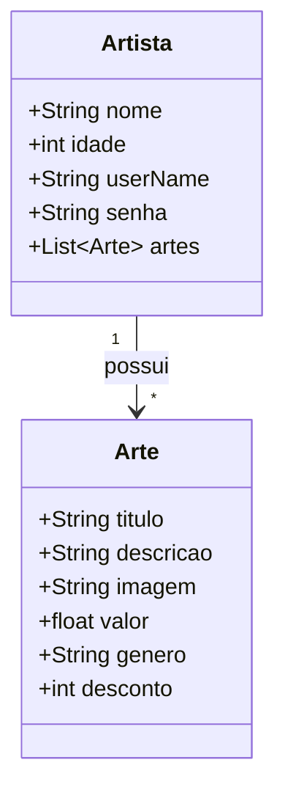

# FotoHub

Feito com Fastify 

execute primeiro : `npm install`

Executar projeto: `npm run dev`

## Requisitos

- TypeScript
    - tsx
    - typescript
    - @types/
        - jsonwebtoken
        - mongoose
        - node
- fastify
- fastify-jwt
- fastify-type-provider-zod
- jsonwebtoken
- mongoose
- zod
- dotenv
- @fastify/
    - cors
    - jwt

## Diagrama

