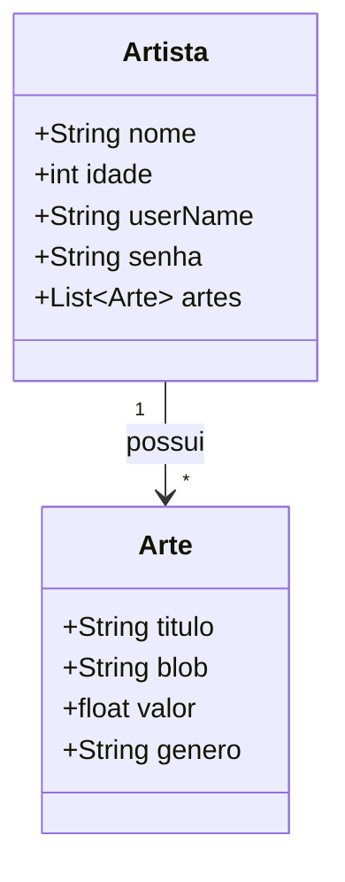

# FotoHub

Feito com Fastify 

execute primeiro : `npm install`

Executar projeto: `npm run dev`

## Diagrama

```mermaid
classDiagram
    class Artista {
        +String nome
        +int idade
        +String userName
        +String senha
        +List~Arte~ artes
    }
    
    class Arte {
        +String titulo
        +String blob
        +float valor
        +String genero
    }
    
    Artista "1" --> "*" Arte : possui

```